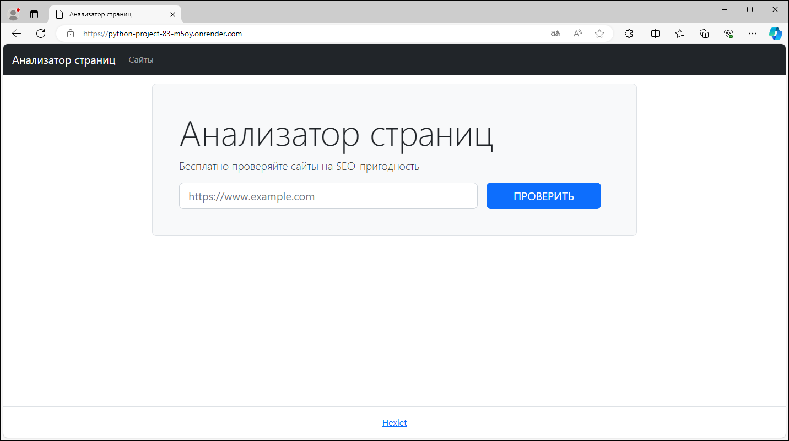
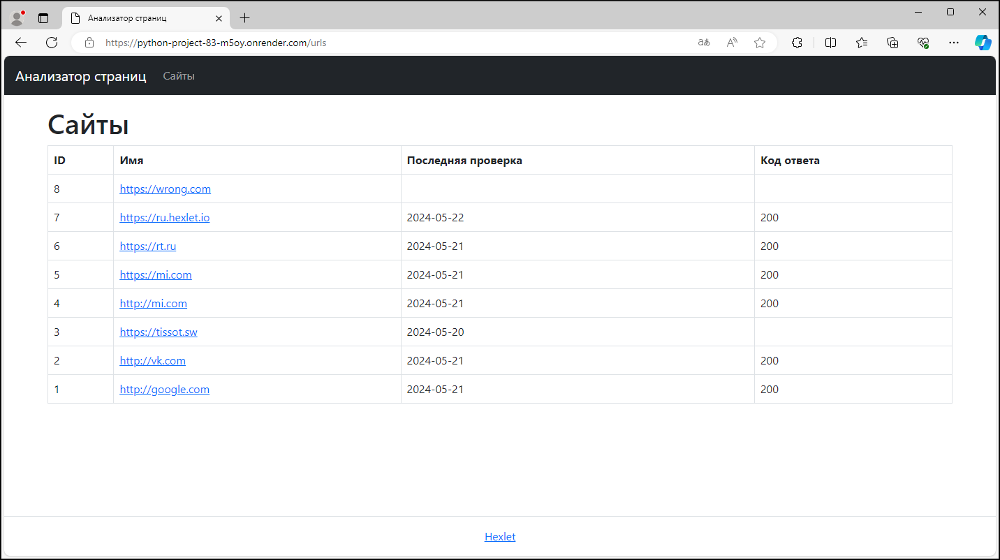
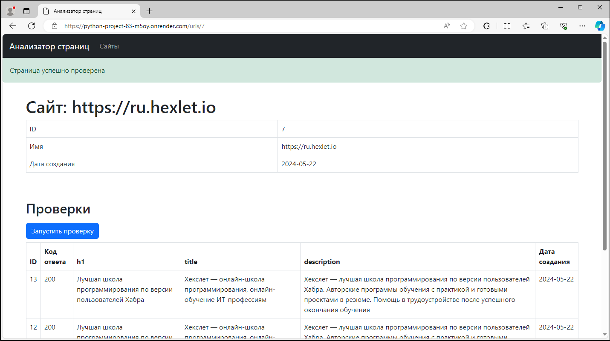

### Hexlet tests and linter status:

  
### flake8 status:

### CodeClimat status:

  
  
## Page Analyzer
  
**Project Description:**
  
[Page Analyzer](https://python-project-83-m5oy.onrender.com) is a site that analyzes specified pages for SEO suitability, similar to PageSpeed ​​Insights:  
  
  
  
  
  
  
